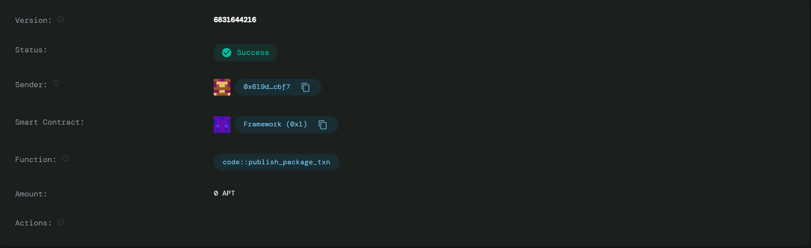

Unbreakable Trust: Blockchain-Based Proof System for Ethical Borrowing
Project Description
Unbreakable Trust is a revolutionary blockchain-based smart contract system designed to combat fraud and promote transparency in money lending practices. The system leverages the immutable nature of blockchain technology to securely store borrower identity proofs and signed agreement photos, creating an unalterable record of financial transactions.

This project addresses the critical issue of unverified financial dealings that often lead to disputes, fraud, and in extreme cases, emotional distress and tragic outcomes. By providing a transparent, tamper-proof system for recording lending agreements, Unbreakable Trust creates accountability and trust between lenders and borrowers.

Project Vision
Our vision is to create a world where financial lending is transparent, secure, and free from fraud. We aim to:

Eliminate Financial Fraud: By creating immutable records of all lending agreements
Promote Ethical Lending: Ensuring all parties have verifiable proof of transactions
Reduce Emotional Distress: Preventing disputes through clear, unalterable documentation
Build Trust: Creating a transparent ecosystem where lenders and borrowers can interact with confidence
Save Lives: By reducing the stress and conflicts that arise from unverified financial dealings
Key Features
🔐 Immutable Record Storage
All borrowing agreements are permanently stored on the blockchain
Records cannot be deleted, modified, or tampered with after creation
Provides permanent audit trail for all financial transactions
📸 Proof Documentation System
Stores cryptographic hashes of borrower identity proofs
Secures signed agreement photos using blockchain technology
Prevents document forgery and unauthorized modifications
🛡️ Anti-Fraud Protection
Verifiable identity verification system
Transparent transaction history
Prevents duplicate agreements and identity theft
👥 Multi-Party Verification
Both lender and borrower addresses are recorded
Only authorized parties can update loan status
Clear ownership and responsibility tracking
⏰ Timestamp Verification
Automatic timestamp recording for all agreements
Provides chronological proof of when agreements were made
Helps resolve timing-related disputes
🎯 Active Status Tracking
Real-time loan status monitoring
Lenders can mark loans as repaid while preserving records
Maintains transparency throughout the loan lifecycle
Future Scope
Phase 1: Enhanced Security Features
Multi-signature Verification: Require multiple parties to confirm major changes
Biometric Integration: Advanced identity verification using biometric data
Smart Oracles: Integration with external data sources for automatic verification
Phase 2: Advanced Functionality
Interest Rate Management: Automated interest calculation and tracking
Payment Scheduling: Smart contract-based payment reminders and tracking
Credit Score Integration: Building on-chain credit history for borrowers
Dispute Resolution: Automated arbitration system for conflicts
Phase 3: Ecosystem Expansion
Mobile Application: User-friendly mobile interface for easy access
Integration APIs: Connect with existing financial platforms and banks
Multi-chain Support: Expand to other blockchain networks for broader adoption
Regulatory Compliance: Ensure compliance with global financial regulations
Phase 4: AI and Analytics
Risk Assessment AI: Machine learning algorithms for loan risk evaluation
Fraud Detection: Advanced AI systems to identify suspicious activities
Predictive Analytics: Forecasting default risks and market trends
Automated Compliance: AI-driven regulatory compliance monitoring
Phase 5: Global Impact
Microfinance Integration: Support for small-scale lending in developing regions
Educational Programs: Financial literacy initiatives powered by blockchain
Community Building: Creating networks of trusted lenders and borrowers
Social Impact Tracking: Measuring and documenting positive social outcomes
Contract Details
[This section will be filled with specific contract deployment details, addresses, and technical specifications]

Getting Started
Prerequisites
Aptos CLI installed
Aptos wallet set up
Basic understanding of Move language
Installation
Clone the repository
Initialize Aptos Move project
Compile the contract
Deploy to Aptos blockchain
Usage
Create borrowing agreements with immutable proof storage
Track loan status and repayment
Verify agreement authenticity through blockchain records
Contributing
We welcome contributions to make Unbreakable Trust even more robust and accessible. Please read our contributing guidelines and submit pull requests for any improvements.

License
This project is licensed under the MIT License - see the LICENSE file for details.

Support
For support and questions, please contact our development team or create an issue in the repository.

*contract addresses 0x619d5ef977981bf1a3984aed628990fb99381f10528b0e713bc784977083cbf7

