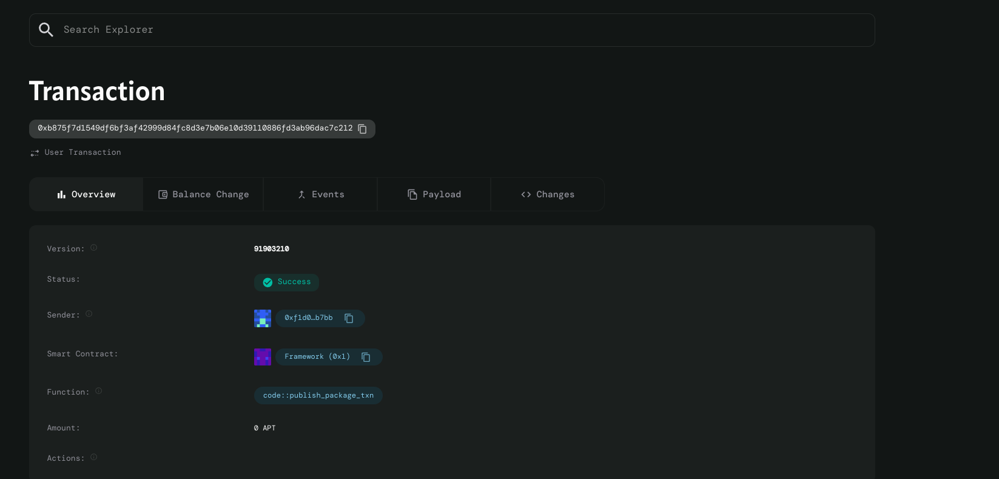

# Token Standards Library

## Project Description

The Token Standards Library is a foundational smart contract built on the Aptos blockchain that provides standardized token interface implementations. This contract serves as a basic building block for creating and managing custom tokens with essential functionalities like minting and transferring. Built using Move programming language, it offers a secure and efficient way to handle token operations while maintaining compatibility with Aptos ecosystem standards.

The contract implements core token functionality through two primary functions: token initialization with minting capabilities and secure token transfers between accounts. It includes proper event emission for tracking token operations and implements essential error handling to ensure transaction safety.

## Project Vision

Our vision is to democratize token creation on the Aptos blockchain by providing developers with a simple, secure, and standardized foundation for building token-based applications. We aim to reduce the complexity barrier for token implementation while ensuring adherence to best practices in blockchain development.

By offering this standardized library, we envision fostering innovation in the Aptos ecosystem, enabling developers to focus on building unique application logic rather than reinventing basic token mechanics. This library serves as a stepping stone towards more complex DeFi applications, NFT platforms, and tokenized systems.

## Key Features

### Core Functionality
- **Token Minting**: Initialize new tokens with custom name, symbol, and initial supply
- **Secure Transfers**: Transfer tokens between accounts with balance validation
- **Event Tracking**: Comprehensive event emission for mint and transfer operations
- **Error Handling**: Built-in checks for insufficient balance and invalid operations

### Technical Features
- **Aptos Native**: Built specifically for the Aptos blockchain using Move language
- **Gas Efficient**: Optimized contract structure for minimal transaction costs
- **Type Safety**: Leverages Move's type system for enhanced security
- **Modular Design**: Clean, reusable code structure for easy integration

### Security Features
- **Balance Validation**: Prevents overdraft scenarios with built-in balance checks
- **Safe Arithmetic**: Protected against integer overflow/underflow issues
- **Access Control**: Proper signer validation for authorized operations
- **Resource Management**: Efficient use of Aptos resource model

## Future Scope

### Short-term Enhancements
- **Multi-Account Balance Management**: Implement comprehensive balance tracking across multiple accounts
- **Token Allowances**: Add approval mechanisms for third-party token spending
- **Batch Operations**: Support for bulk token transfers and operations
- **Token Metadata**: Extended metadata support including decimals, description, and logos

### Medium-term Development
- **Standard Compliance**: Full compliance with emerging Aptos token standards
- **Access Control Lists**: Role-based permissions for minting and administrative functions
- **Token Burning**: Capability to permanently remove tokens from circulation
- **Freezing Mechanisms**: Ability to temporarily halt token transfers for security

### Long-term Vision
- **Cross-Chain Compatibility**: Integration with bridge protocols for multi-chain token operations
- **DeFi Integration**: Built-in hooks for liquidity provision and yield farming protocols
- **Governance Features**: Token-based voting and proposal mechanisms
- **NFT Support**: Extension to support non-fungible token standards
- **Advanced Analytics**: On-chain metrics and reporting capabilities

### Ecosystem Integration
- **Wallet Compatibility**: Seamless integration with popular Aptos wallets
- **DEX Support**: Native compatibility with decentralized exchanges
- **Developer Tools**: SDK and CLI tools for easy contract interaction
- **Documentation Portal**: Comprehensive guides and tutorials for developers

## Contract Details

0xb875f7d1549df6bf3af42999d84fc8d3e7b06e10d39110886fd3ab96dac7c212

